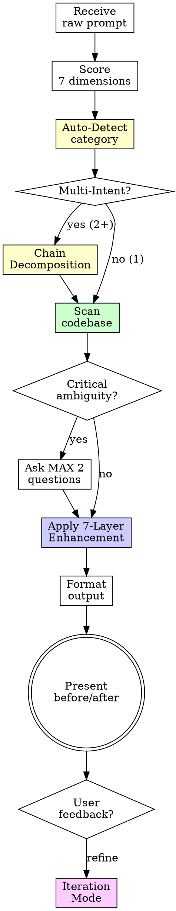

# Enhance Prompt

## Overview

Transform raw, vague, or incomplete prompts into professional-grade, context-rich instructions that produce optimal AI output.

**Core principle:** A bad prompt produces bad output. Every minute spent on prompt quality saves ten minutes of wrong output.

**Announce at start:** "I'm using the enhance-prompt skill to transform your prompt into a professional-grade instruction."

<HARD-GATE>
Do NOT output an enhanced prompt without first scanning the codebase for context. Even if the prompt seems clear, codebase context ALWAYS improves it. No exceptions.
</HARD-GATE>

## The Iron Law

```
NO ENHANCED PROMPT WITHOUT CODEBASE CONTEXT
```

Skipping the codebase scan? The enhanced prompt will be generic. Generic prompts produce generic output. That defeats the purpose.

## When to Use

**Always:**
- Prompt under 10 words
- Vague action verbs ("fix", "improve", "update", "optimize")
- Missing file paths, function names, or technical details
- Non-English prompt
- Code snippet with unclear instruction

**Especially when:**
- User pastes raw prompt and asks to improve it
- `/enhance-prompt` slash command is invoked
- User says "write a prompt for..." or "prompt to..."

## Checklist

You MUST complete these steps in order:

1. **Score the raw prompt** — 7-dimension scorecard (see `references/prompt-patterns.md`)
2. **Auto-detect category** — match intent to template (see `references/auto-detection.md`)
3. **Check for multi-intent** — if 2+ concerns detected, trigger chain decomposition (see `references/prompt-chain.md`)
4. **Scan the codebase** — follow `references/codebase-analysis.md` procedure
5. **Ask clarifying questions** — MAX 2, only if critical ambiguity remains after scan
6. **Apply 7-Layer Enhancement** — Clarity → Specificity → Context → Structure → Constraints → Output → Verification
7. **Format output** — follow `references/output-format.md` template
8. **Present before/after** — show scoring improvement and copy-ready version
9. **Support iteration** — if user requests refinement, follow `references/iteration-mode.md`

## Process Flow



## The 7-Layer Enhancement

Each layer is mandatory. Skipping layers produces weak prompts.

| Layer | What | Red Flag If Missing |
|-------|------|---------------------|
| **1. Clarity** | Remove ambiguity, define terms | Multiple interpretations possible |
| **2. Specificity** | File paths, function names, line numbers | "Fix the thing" without WHERE |
| **3. Context** | Tech stack, patterns, dependencies from scan | AI has to guess the project |
| **4. Structure** | Context → Task → Constraints → Output sections | Wall of text |
| **5. Constraints** | DO/DON'T rules, boundaries, edge cases | No guardrails = wrong output |
| **6. Output Format** | Code block, diff, step-by-step, docs | AI chooses random format |
| **7. Verification** | Testable success criteria | "Done" is subjective |

**Details and examples:** See `references/prompt-patterns.md`

## Red Flags — STOP and Redo

- Enhanced prompt has no file paths → Redo Layer 2
- No tech stack or dependencies mentioned → Redo Layer 3
- Output is a wall of text without sections → Redo Layer 4
- No DO/DON'T constraints → Redo Layer 5
- No verification criteria → Redo Layer 7
- Prompt is longer than the solution → Over-engineered, simplify
- Enhanced prompt contradicts codebase patterns → Rescan codebase
- Same information repeated across sections → Consolidate, remove redundancy
- All "After" scores are 5/5 → Likely inflated, re-evaluate each dimension honestly
- Verification criteria are subjective ("works well", "looks good") → Replace with testable commands/thresholds

## Common Rationalizations

| Excuse | Reality |
|--------|---------|
| "Prompt is clear enough" | If it were, you wouldn't need this skill |
| "Codebase scan takes too long" | 30 seconds of scanning saves 10 minutes of wrong output |
| "Context is obvious" | Obvious to you. Not to the AI reading it cold |
| "I'll add details later" | You won't. Enhanced prompt is the details |
| "Just make it longer" | Length ≠ quality. Specificity = quality |

## Multilingual Handling

When prompt is not in English:
1. Detect language automatically
2. Preserve the user's intent — translate meaning, not words
3. Use English for ALL technical terms (`database`, `authentication`, `frontend`)
4. Output enhanced prompt in user's language with English technical terms

## References

- `references/prompt-patterns.md` — 7-Layer framework with examples and scoring
- `references/codebase-analysis.md` — Multi-level scanning with monorepo and framework detection
- `references/output-format.md` — Structured output template with risk assessment
- `references/prompt-library.md` — 6 core prompt templates
- `references/prompt-library-extended.md` — 7 extended prompt templates
- `references/auto-detection.md` — Auto-category detection and template selection
- `references/prompt-chain.md` — Prompt chain decomposition for multi-intent prompts
- `references/iteration-mode.md` — Enhancement iteration and refinement tracking

## Key Principles

- **Codebase context is non-negotiable** — Always scan before enhancing
- **Auto-detect, don't assume** — Use signal matching to identify prompt intent before selecting a template
- **One concern per prompt** — Multi-intent prompts get decomposed into focused chains
- **Specificity beats length** — `src/auth/login.ts:42` > paragraph of description
- **Score before and after** — Prove the enhancement worked
- **Score honestly** — Inflated "After" scores help no one; every 4-5 must be justified by specific content
- **Iterate with precision** — Apply targeted changes on feedback, don't rewrite everything; max 3 iterations
- **One question at a time** — Don't overwhelm with clarification requests
- **Copy-ready output** — End with clean version ready to paste anywhere
- **Output efficiency** — Enhanced prompt must be concise and non-redundant; if it's longer than 700 words for a simple task, trim it
