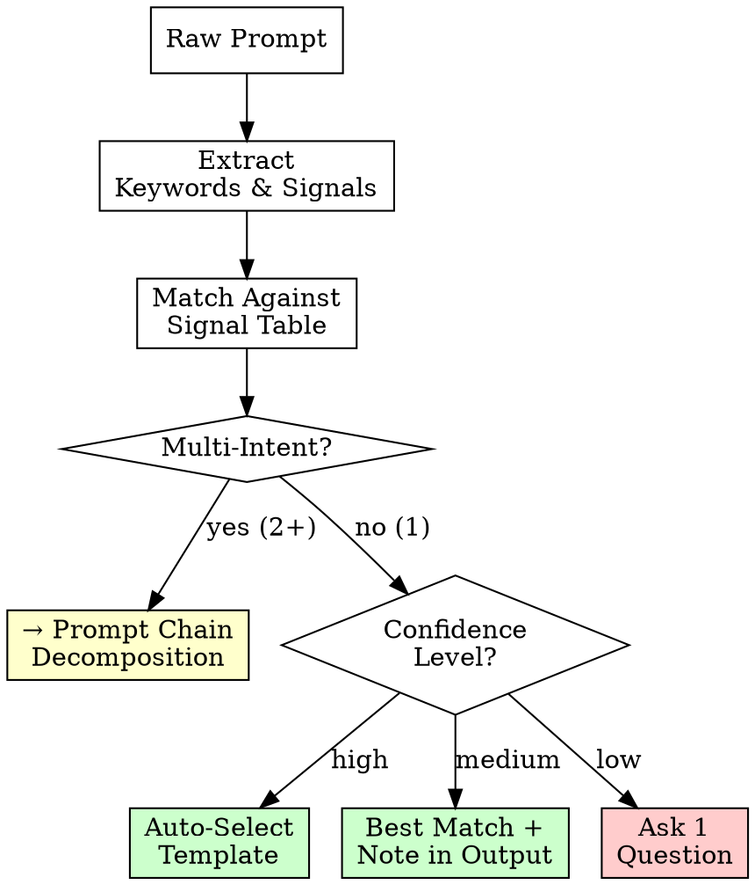

# Auto-Category Detection

> Automatically analyze prompt intent and select the best matching template. No guesswork.

---

## How It Works

Before enhancement begins, scan the raw prompt for **intent signals** — keywords, patterns, and structural cues that reveal what the user actually wants.

**Process:**
1. Extract keywords and action verbs from raw prompt
2. Match against signal table below
3. Select primary category (highest signal match)
4. If multi-intent detected → trigger Prompt Chain Decomposition (see `prompt-chain.md`)

---

## Signal Table

| Category | Primary Signals | Secondary Signals | Template |
|----------|----------------|-------------------|----------|
| 🐛 Bug Fix | `fix`, `bug`, `error`, `crash`, `broken`, `doesn't work`, `fails`, `exception`, `null`, `undefined` | Stack trace pasted, error message quoted, "used to work" | Template 1 |
| ✨ New Feature | `add`, `create`, `implement`, `build`, `new`, `introduce`, `support` | No existing file referenced, describes desired behavior | Template 2 |
| ⚡ Performance | `slow`, `optimize`, `fast`, `speed`, `performance`, `latency`, `cache`, `lazy`, `bundle size`, `memory` | Metrics mentioned, profiling data, "takes too long" | Template 3 |
| 🔄 Refactor | `refactor`, `restructure`, `extract`, `split`, `clean up`, `reorganize`, `decouple`, `modularize` | "Too big", "messy", "hard to maintain", line count | Template 4 |
| 🔒 Security | `security`, `vulnerability`, `audit`, `XSS`, `injection`, `CSRF`, `auth`, `permission`, `OWASP`, `CVE` | "Penetration", "sanitize", "escape", "hardcoded" | Template 5 |
| 📝 Documentation | `document`, `docs`, `README`, `JSDoc`, `comment`, `explain`, `describe`, `usage` | "No docs", "undocumented", "how to use" | Template 6 |
| 🧪 Testing | `test`, `coverage`, `unit test`, `integration test`, `mock`, `TDD`, `spec`, `assert` | Coverage percentage, "untested", "flaky" | Template 7 |
| 🎨 UI/Styling | `UI`, `CSS`, `style`, `layout`, `responsive`, `design`, `component`, `animation`, `theme`, `dark mode` | Breakpoints, Figma, "looks wrong", "mobile" | Template 8 |
| 🔌 API Integration | `API`, `endpoint`, `REST`, `GraphQL`, `webhook`, `integrate`, `third-party`, `SDK`, `fetch` | URL patterns, HTTP methods, "connect to" | Template 9 |
| 🚀 DevOps | `deploy`, `CI/CD`, `Docker`, `pipeline`, `infrastructure`, `monitoring`, `health check`, `rollback` | Platform names (Vercel, AWS), "production" | Template 10 |
| 🗃️ Database | `database`, `migration`, `schema`, `index`, `query`, `SQL`, `ORM`, `table`, `column`, `relation` | Model names, "slow query", "add field" | Template 11 |
| 🔍 Deep Scan | `investigate`, `root cause`, `trace`, `debug`, `analyze`, `why`, `scan`, `diagnose` | "Intermittent", "sometimes", "randomly fails" | Template 12 |
| 👀 Code Review | `review`, `check`, `audit code`, `code quality`, `best practices`, `patterns`, `SOLID` | PR reference, "look at this code", file list | Template 13 |

---

## Multi-Intent Detection

When a prompt contains signals from **2+ categories**, it's a multi-intent prompt.

**Examples:**
```
"Fix the login bug and add 2FA support"
→ 🐛 Bug Fix + ✨ New Feature → Chain decomposition

"Optimize the API and add caching and write tests"
→ ⚡ Performance + ✨ New Feature + 🧪 Testing → Chain decomposition

"Refactor the auth module and audit for security issues"
→ 🔄 Refactor + 🔒 Security → Chain decomposition
```

**Rule:** If multi-intent detected, trigger `prompt-chain.md` decomposition instead of forcing into a single template.

---

## Confidence Scoring

Rate detection confidence:

| Confidence | Criteria | Action |
|------------|----------|--------|
| **High** (3+ signals match) | Multiple keywords + structural cues align | Auto-select template, proceed |
| **Medium** (1-2 signals match) | Some keywords match but intent is ambiguous | Select best match, note in Enhancement Notes |
| **Low** (0 signals match) | No clear intent signals detected | Ask 1 clarifying question: "Is this a [A] or [B]?" |

---

## Detection Flow



---

## Integration with Enhancement Flow

Auto-detection runs **after scoring, before codebase scan:**

1. Score raw prompt (existing step)
2. **→ Auto-detect category** (NEW)
3. Scan codebase (existing step)
4. Apply template + 7-Layer Enhancement (existing step, now with auto-selected template)

The detected category informs:
- Which template to use as enhancement starting point
- Which Level 3 deep scan targets to prioritize
- Which sections of the output format to emphasize

---

## Anti-Patterns

| Anti-Pattern | Why It Fails | Fix |
|-------------|-------------|-----|
| Forcing single category on multi-intent | Loses half the prompt | Use prompt chain decomposition |
| Ignoring secondary signals | Misses the real intent | Weight secondary signals when primary is ambiguous |
| Over-relying on keywords | "Fix the deployment" ≠ Bug Fix, it's DevOps | Check context around keywords, not just keywords alone |
| Defaulting to "New Feature" | Lazy detection | If confidence is low, ASK — don't assume |
