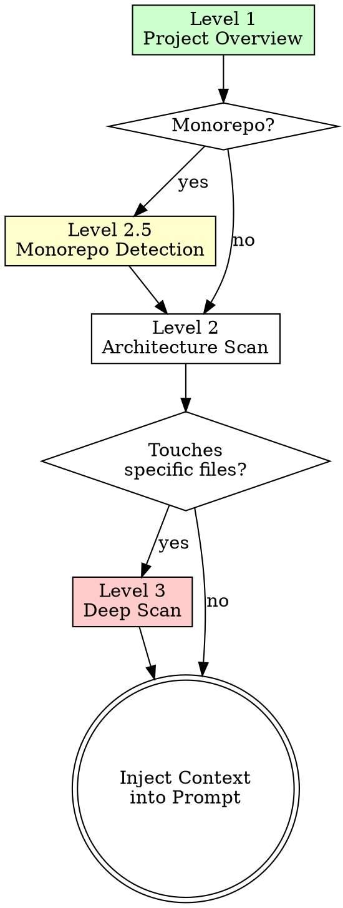

# Codebase Analysis for Prompt Enhancement

> Non-negotiable. Every enhanced prompt MUST include codebase context.

<HARD-GATE>
Do NOT skip any scan level. If Level 1 finds a monorepo, Level 2.5 is MANDATORY.
If the prompt references specific files, Level 3 is MANDATORY.
</HARD-GATE>

---

## The Scanning Process



---

## Level 1: Project Overview (ALWAYS)

**Run these commands FIRST:**

```
# 1. Understand structure
List the project root directory

# 2. Extract tech stack
Read package.json / pyproject.toml / Cargo.toml / go.mod

# 3. Check code style
Read tsconfig.json / .eslintrc / prettier.config (if exists)

# 4. Check services
Read .env.example / docker-compose.yml (if exists)
```

**Extract:**

| File | What to Extract |
|------|-----------------|
| `package.json` | Framework, dependencies, scripts |
| `tsconfig.json` | TypeScript config, module resolution |
| `README.md` | Project purpose, setup instructions |
| `.env.example` | External services, API keys needed |
| `docker-compose.yml` | Infrastructure, databases, services |

---

## Level 2: Architecture Scan

| What to Find | How | Why It Matters |
|-------------|-----|----------------|
| **Directory structure** | List `src/` directory | WHERE to create/modify files |
| **Import patterns** | Search for `import` statements | Module resolution style |
| **Naming conventions** | Find component files by name | camelCase vs kebab-case vs PascalCase |
| **State management** | Search for store/context/redux | Which state solution |
| **Routing** | Scan `pages/` or `app/` dirs | File-based vs config-based |

---

## Level 2.5: Monorepo & Framework Detection

**Monorepo Indicators:**

| File | Monorepo Type | Action |
|------|--------------|--------|
| `turbo.json` | Turborepo | Scan `apps/`, `packages/` — identify target workspace |
| `nx.json` | Nx | Scan `libs/`, `apps/` — check project graph |
| `lerna.json` | Lerna | Scan `packages/` — check hoisting |
| `pnpm-workspace.yaml` | PNPM Workspaces | Read workspace config |
| Multiple `package.json` | Any monorepo | Root vs package-level config |

**Framework-Specific Scanning:**

| Framework | Detection | Key Files to Scan |
|-----------|-----------|-------------------|
| **Next.js App Router** | `app/` dir + `next.config` | `layout.tsx`, `page.tsx`, server actions |
| **Next.js Pages Router** | `pages/` dir | `_app.tsx`, `getServerSideProps` |
| **FastAPI** | `from fastapi` imports | Routers, Pydantic models |
| **Django** | `settings.py` + `urls.py` | Models, views, serializers |
| **Express/NestJS** | `express` / `@nestjs` in deps | Middleware, controllers |

**Workspace boundary detection:**
```
1. Find nearest package.json to the prompt's target
2. Check if monorepo → identify which workspace
3. Scope context to THAT workspace only
4. Include shared packages only if imported
```

---

## Level 3: Deep Scan (Specific files)

| What | How | Context Value |
|------|-----|---------------|
| **Function signatures** | Read target file to inspect exports | Exact params, return types |
| **Related tests** | Find files matching `*.test.*` | Existing test patterns |
| **Type definitions** | Search for `interface` / `type` | Data shapes |
| **Error handling** | Search for `catch` / `throw` | Error strategy |
| **Similar implementations** | Search for similar features | Patterns to follow |

---

## Context Injection Template

After scanning, inject into the enhanced prompt:

```markdown
## Context

### Project
- **Type:** [Next.js 14 App Router / FastAPI / Express]
- **Language:** [TypeScript 5.3 / Python 3.12]
- **Package Manager:** [pnpm / npm / poetry]

### Relevant Files
- `[file-path]` — [purpose]

### Existing Patterns
- [Pattern found in codebase]

### Dependencies (relevant only)
- `[package]` v[version] — [what it does]

### Constraints from Codebase
- [e.g., "All routes use `authGuard` middleware"]
```

---

## Anti-Patterns — STOP If You Catch Yourself

| Anti-Pattern | Why It Fails | Fix |
|-------------|-------------|-----|
| Dumping entire file tree | Noise overwhelms signal | List relevant dirs only |
| Including all dependencies | Most are irrelevant | Only project-specific deps |
| Copying full file contents | Token waste | Extract relevant functions only |
| Guessing the tech stack | Wrong context = wrong output | ALWAYS verify from config |
| Skipping .env.example | Missing service dependencies | Always check env vars |
