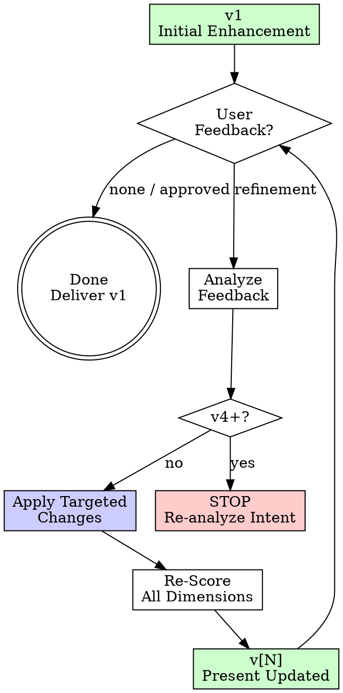

# Enhancement Iteration Mode

> First enhancement is a draft. Iteration makes it precise. Track improvement across rounds.

---

## When to Iterate

**Trigger:** User provides feedback on an enhanced prompt and asks for refinement.

**Common iteration requests:**
```
"Make it more specific about the database queries"
"Add constraints about backward compatibility"
"The context is missing the Redis caching layer"
"Simplify — too many steps"
"Focus on the security aspect more"
```

**NOT iteration (these are new prompts):**
```
"Now enhance this completely different prompt"
"Forget that, do this instead"
```

---

## Iteration Rules

### Rule 1: Preserve What Works
Don't rewrite the entire enhancement. Apply targeted changes to the specific area the user flagged.

### Rule 2: Track Changes
Show what changed between iterations with a delta summary.

### Rule 3: Re-Score After Each Iteration
Update the scoring table to reflect improvements. Scores can go up OR down (e.g., adding too much detail can reduce Clarity).

### Rule 4: Max 3 Iterations
If the prompt hasn't converged after 3 iterations, something is fundamentally wrong. Stop and re-analyze the original intent.

| Iteration | Purpose |
|-----------|---------|
| **v1** | Initial enhancement from raw prompt |
| **v2** | Refinement based on user feedback |
| **v3** | Final polish — should be production-ready |
| **v4+** | STOP — re-analyze original intent from scratch |

---

## Iteration Output Format

```markdown
## 🔄 Iteration [N] — [Brief description of change]

### What Changed
- **[Section]:** [What was added/modified/removed] — [Why]

### Updated Scoring

| Metric | v1 | v[N] | Delta |
|--------|-----|------|-------|
| Clarity | [score] | [score] | [+/-] |
| Specificity | [score] | [score] | [+/-] |
| Context | [score] | [score] | [+/-] |
| Structure | [score] | [score] | [+/-] |
| Constraints | [score] | [score] | [+/-] |
| Output Format | [score] | [score] | [+/-] |
| Verification | [score] | [score] | [+/-] |
| **Total** | **[/35]** | **[/35]** | **[+/-]** |

### Updated Enhanced Prompt
[Full updated prompt — not just the diff, the complete version]

### 📋 Updated Copy-Ready Prompt
[Clean extraction of updated Context/Task/Constraints/Output/Verification]
```

---

## Iteration Flow



---

## Feedback Analysis Patterns

Map user feedback to specific enhancement actions:

| Feedback Pattern | Action | Layer Affected |
|-----------------|--------|----------------|
| "More specific about X" | Add file paths, function names, line numbers for X | Layer 2: Specificity |
| "Missing context about Y" | Re-scan codebase for Y, inject findings | Layer 3: Context |
| "Too complex / too many steps" | Consolidate steps, remove low-priority items | Layer 1: Clarity |
| "Add constraint about Z" | Add DO/DON'T rule for Z | Layer 5: Constraints |
| "Wrong output format" | Change Output Format section | Layer 6: Output |
| "How do I verify this?" | Add testable verification criteria | Layer 7: Verification |
| "Break this into smaller steps" | Restructure Task section, number sub-steps | Layer 4: Structure |
| "Focus more on [aspect]" | Re-weight sections, expand target area | Multi-layer |

---

## Score Delta Rules

| Delta | Meaning |
|-------|---------|
| **+1 to +2** | Normal improvement from targeted refinement |
| **+3 or more on a single dimension** | Suspicious — was v1 scored too low? Verify both scores |
| **-1** | Acceptable — adding specificity can reduce clarity if overdone |
| **-2 or more** | Something went wrong — iteration made it worse, revert that change |
| **0 across all dimensions** | Iteration had no impact — was the feedback actually addressed? |

---

## Example: Iteration in Action

### v1 (Initial Enhancement)
```
Score: 8/35 → 28/35
Task: "Optimize database queries in the orders module"
```

### User Feedback
> "You missed that we use Redis for caching. Also add a constraint about not breaking the existing API response format."

### v2 (After Iteration)
```markdown
## 🔄 Iteration 2 — Added Redis context + API compatibility constraint

### What Changed
- **Context:** Added Redis caching layer (v7.0, `src/cache/redis.ts`) — affects optimization strategy
- **Constraints:** Added "Don't change API response shapes" — backward compatibility requirement

### Updated Scoring
| Metric | v1 | v2 | Delta |
|--------|-----|-----|-------|
| Clarity | 4 | 4 | 0 |
| Specificity | 4 | 4 | 0 |
| Context | 3 | 5 | +2 |
| Structure | 4 | 4 | 0 |
| Constraints | 4 | 5 | +1 |
| Output Format | 5 | 5 | 0 |
| Verification | 4 | 4 | 0 |
| **Total** | **28/35** | **31/35** | **+3** |
```

---

## Anti-Patterns

| Anti-Pattern | Why It Fails | Fix |
|-------------|-------------|-----|
| Full rewrite on every iteration | Wastes effort, loses good parts | Apply targeted changes only |
| Not re-scoring | Can't measure if iteration helped | Always update scoring table with delta |
| Ignoring score decreases | Iteration can make things worse | If score drops ≥ 2 on any dimension, revert |
| Endless iterations (4+) | Prompt is fundamentally unclear | Stop, re-analyze original intent |
| Treating new prompt as iteration | Different intent = new enhancement | Start fresh if intent changed |
