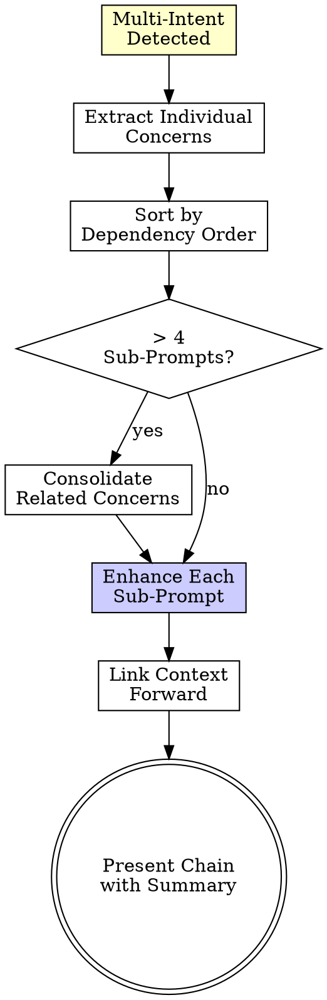

# Prompt Chain Decomposition

> Complex prompts deserve focused attention. One concern per prompt. Chain them for compound tasks.

---

## When to Chain

**Trigger:** Raw prompt contains **2+ distinct concerns** detected by Auto-Category Detection (see `auto-detection.md`).

**Examples that need chaining:**
```
❌ "Fix the login bug, add OAuth, and improve the auth page performance"
   → 3 concerns: Bug Fix + New Feature + Performance

❌ "Refactor the user service, add tests, and update the API docs"
   → 3 concerns: Refactor + Testing + Documentation

❌ "Audit security, fix vulnerabilities found, and deploy the fix"
   → 3 concerns: Security Audit + Bug Fix + DevOps
```

**Examples that DON'T need chaining:**
```
✅ "Fix the null reference error in handleSubmit" → Single concern: Bug Fix
✅ "Add JWT authentication to the API" → Single concern: New Feature
✅ "Optimize database queries for the orders page" → Single concern: Performance
```

---

## Decomposition Rules

### Rule 1: One Concern Per Sub-Prompt
Each sub-prompt addresses exactly ONE category from the signal table. No mixing.

### Rule 2: Dependency Order
Chain sub-prompts in logical execution order:

| Order | Priority | Rationale |
|-------|----------|-----------|
| 1st | 🔍 Deep Scan / Investigation | Understand before changing |
| 2nd | 🐛 Bug Fix | Fix broken things before building new |
| 3rd | 🔒 Security Audit | Secure foundation before adding features |
| 4th | 🔄 Refactor | Clean structure before extending |
| 5th | ✨ New Feature | Build on clean, secure, working code |
| 6th | ⚡ Performance | Optimize after correctness |
| 7th | 🧪 Testing | Test the final state |
| 8th | 📝 Documentation | Document the final result |
| 9th | 🚀 DevOps / Deploy | Ship last |

### Rule 3: Context Carries Forward
Each sub-prompt inherits context from previous steps:
```
Sub-prompt 2 references: "After completing [Sub-prompt 1 task]..."
Sub-prompt 3 references: "With [Sub-prompt 1] and [Sub-prompt 2] completed..."
```

### Rule 4: Max 4 Sub-Prompts
If decomposition yields more than 4 sub-prompts, consolidate related ones:
- Bug Fix + Deep Scan → combine as "Investigate & Fix"
- Testing + Documentation → can be parallel, not sequential

---

## Chain Output Format

```markdown
## 🔗 Prompt Chain Detected

**Original prompt contains [N] distinct concerns.**
Decomposed into [N] focused sub-prompts for optimal results.

**Execution Order:**
1. [emoji] **[Category]** — [one-line summary]
2. [emoji] **[Category]** — [one-line summary]
3. [emoji] **[Category]** — [one-line summary]

---

### Sub-Prompt 1 of [N]: [emoji] [Category]

[Full enhanced prompt using the appropriate template]
[Includes: Context → Task → Constraints → Output → Verification]

---

### Sub-Prompt 2 of [N]: [emoji] [Category]

**Depends on:** Sub-Prompt 1
**Context carries forward:** [What from Sub-Prompt 1 affects this]

[Full enhanced prompt using the appropriate template]

---

### Sub-Prompt [N] of [N]: [emoji] [Category]

**Depends on:** Sub-Prompt [N-1]
**Context carries forward:** [Accumulated context]

[Full enhanced prompt using the appropriate template]

---

## 📊 Chain Summary

| # | Category | Complexity | Time Est. | Risk |
|---|----------|-----------|-----------|------|
| 1 | [Category] | [Low/Med/High] | [time] | [risk] |
| 2 | [Category] | [Low/Med/High] | [time] | [risk] |
| **Total** | | | **[total time]** | **[highest risk]** |
```

---

## Decomposition Flow



---

## Example: Full Chain Decomposition

### Input
> "Fix the login bug, add 2FA support, and write tests for auth"

### Detection
- 🐛 "Fix the login bug" → Bug Fix (Template 1)
- ✨ "add 2FA support" → New Feature (Template 2)
- 🧪 "write tests for auth" → Testing (Template 7)

### Output

```markdown
## 🔗 Prompt Chain Detected

**Original prompt contains 3 distinct concerns.**
Decomposed into 3 focused sub-prompts for optimal results.

**Execution Order:**
1. 🐛 **Bug Fix** — Fix login null reference error
2. ✨ **New Feature** — Implement TOTP-based 2FA
3. 🧪 **Testing** — Add auth module test coverage

---

### Sub-Prompt 1 of 3: 🐛 Bug Fix

#### Context
Next.js 14 App Router + TypeScript. Auth via `next-auth` v5.
Error: `TypeError: Cannot read property 'email' of null` in `src/auth/login.ts:42`.
Triggered after password reset flow.

#### Task
1. Trace `handleLogin()` → `validateCredentials()` → null check on user object
2. Add null guard at `src/auth/login.ts:42` before accessing `.email`
3. Handle edge case: user deleted between password reset request and login attempt

#### Constraints
- ✅ Add regression test before fixing
- ❌ Don't modify the password reset flow

#### Verification
- [ ] Login after password reset succeeds
- [ ] Deleted user gets clear error message
- [ ] Existing auth tests pass

---

### Sub-Prompt 2 of 3: ✨ New Feature

**Depends on:** Sub-Prompt 1 (login must work before adding 2FA)

#### Context
Auth module at `src/auth/`. Using `next-auth` v5 with credentials provider.
Similar auth feature: `src/auth/providers/google.ts` — follow same patterns.

#### Task
1. Install `otplib` for TOTP generation
2. Create `src/auth/2fa/` with setup, verify, and disable flows
3. Add `twoFactorEnabled` and `twoFactorSecret` to User model
4. Integrate into login flow: after password → if 2FA enabled → prompt code

#### Constraints
- ✅ Follow existing provider pattern in `src/auth/providers/`
- ✅ Secret stored encrypted, never exposed to client
- ❌ Don't break existing login flow for users without 2FA

#### Verification
- [ ] Enable 2FA → QR code displayed → scan with authenticator
- [ ] Login with 2FA → prompted for code → valid code grants access
- [ ] Login without 2FA → existing flow unchanged

---

### Sub-Prompt 3 of 3: 🧪 Testing

**Depends on:** Sub-Prompt 1 + 2 (test the final state)

#### Context
Test framework: Jest. Existing tests: `src/auth/__tests__/`.
Current coverage: 45%. Target: 80%+ for auth module.

#### Task
1. Add unit tests for `handleLogin()` — happy path + null user edge case
2. Add unit tests for 2FA setup, verify, and disable
3. Add integration test: full login flow with and without 2FA
4. Mock `otplib` for deterministic TOTP values

#### Constraints
- ✅ Follow test patterns in `src/auth/__tests__/auth.test.ts`
- ✅ Each test: Arrange → Act → Assert
- ❌ Don't test `next-auth` internals

#### Verification
- [ ] All tests pass: `npm test -- --testPathPattern=auth`
- [ ] Coverage ≥ 80%: `npm test -- --coverage --testPathPattern=auth`
- [ ] No flaky tests: run 3x consecutively

---

## 📊 Chain Summary
| # | Category | Complexity | Time Est. | Risk |
|---|----------|-----------|-----------|------|
| 1 | 🐛 Bug Fix | Low | ~30 min | Low |
| 2 | ✨ New Feature | High | ~4 hours | Medium |
| 3 | 🧪 Testing | Medium | ~2 hours | Low |
| **Total** | | | **~6.5 hours** | **Medium** |
```

---

## Anti-Patterns

| Anti-Pattern | Why It Fails | Fix |
|-------------|-------------|-----|
| Cramming 3 concerns into 1 prompt | AI loses focus, output quality drops | Decompose into chain |
| Random order of sub-prompts | Building on broken foundation | Follow dependency priority order |
| No context linking between sub-prompts | Each sub-prompt operates in vacuum | Carry context forward explicitly |
| 5+ sub-prompts | Too granular, user loses overview | Consolidate related concerns |
| Chaining simple prompts | Overhead without benefit | Only chain multi-intent prompts |
